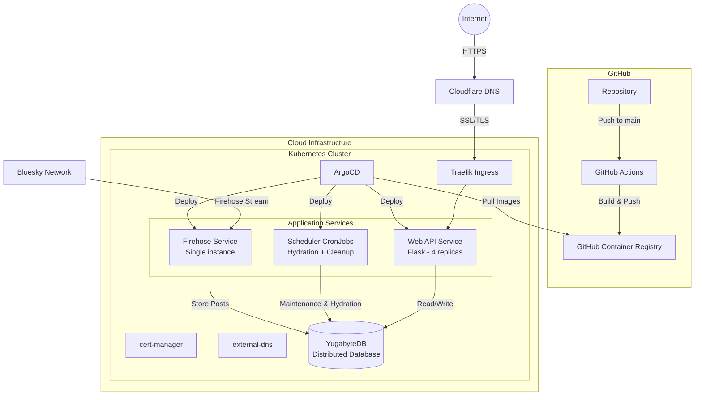

# 🌟 Cosmere ATProto Feed Generator 🌎

<div align="center">

[](#-)
[](#-)
[](#-)
[](#-)
[](#-)

</div>

## 📖 Overview 

A specialized feed service for Brandon Sanderson's Cosmere universe fans, running on Kubernetes and powered by YugabyteDB. This service intelligently filters and combines trending and chronological posts to deliver a curated Cosmere content stream.

## 🏗️ Architecture

The application consists of several microservices deployed on a Kubernetes cluster using Helm charts:

### Main Components
- 🌐 **Web API Service** (`cosmere-feed-bsky`) - Flask application serving the ATProto feed endpoints
- 🔥 **Firehose Service** (`cosmere-firehose`) - Processes the Bluesky firehose stream as a subchart
- ⏰ **Scheduler Service** - Kubernetes CronJobs for periodic tasks and database maintenance
- 📊 **YugabyteDB** - Distributed PostgreSQL-compatible database

### Infrastructure
- 🚀 Hosted on Kubernetes cluster
- 🔒 SSL/TLS termination with cert-manager and Let's Encrypt
- 🌍 DNS management with external-dns and Cloudflare
- 🔄 Load balancing with Traefik ingress controller
- 📦 Container images published to GitHub Container Registry (ghcr.io)
- 🤖 Automated CI/CD with GitHub Actions
- 🔄 GitOps deployment with ArgoCD

## 🎯 Filters

### Keywords and Phrases
The feed uses a comprehensive set of filters to capture Cosmere-related content:

<details>
<summary>View Filter Categories</summary>

### 🔤 Tokens
- `allomancy`, `bondsmith`, `cosmere`, `dalinar`, `dawnshard`, `dragonsteel`, `dustbringer`, `edgedancer`, `elantris`, `elsecaller`, `stormblessed`, `thaidakar`, `kholin`, `lightweaver`, `mistborn`, `oathbringer`, `sanderlanche`, `sazed`, `shadesmar`, `skybreaker`, `spren`, `stoneward`, `stormlight`, `surgebinding`, `truthwatcher`, `warbreaker`, `willshaper`, `windrunner`, `roshar`, `scadrial`, `taldain`, `voidbringer`, `shardblade`, `shardplate`, `shardbearer`, `feruchemy`, `hemalurgy`, `lerasium`, `atium`, `mistcloak`, `kandra`, `koloss`, `skaa`, `highstorm`, `parshendi`, `urithiru`, `honorblade`, `surgebinder`, `dawnshard`, `worldhopper`, `perpendicularity`, `adonalsium`, `chasmfiend`, `worldbringer`, `allomancer`, `highspren`, `elantrian`, `inkspren`, `honorspren`, `cultivationspren`, `peakspren`, `ashspren`, `luckspren`, `windspren`, `lifespren`, `towerlight`, `voidlight`, `brandosando`, `numuhukumakiaki'ialunamor`, `dsnx24`, `dsnx2024`, `dragonsteelnexus`, `dragonsteelnexus2024`

### 🔗 Inclusive Multi-Tokens
- `brandon sanderson`, `yumi sanderson`, `vin elend`, `yumi painter`, `shallan adolin`, `kaladin syl`, `kaladin adolin`, `kaladin shallan`, `navani kholin`, `shallan pattern`, `shallan veil`, `shallan radiant`, `vin kelsier`, `kelsier survivor`, `wax wayne marasi`, `steris marasi`, `cryptic spren`, `steris wax`, `szeth nightblood`, `shades threnody`, `threnody hell`

### 📝 Phrases
- `17th shard`, `bands of mourning`, `brandon sanderson`, `cognitive realm`, `rhythm of war`, `shadows of self`, `sixth of the dusk`, `shadows for silence`, `shadows of silence`, `ember dark`, `emperor's soul`, `isles of the ember dark`, `stormlight archive`, `sunlit man`, `alloy of law`, `hero of ages`, `lost metal`, `way of kings`, `well of ascension`, `tress of the emerald sea`, `wind and truth`, `words of radiance`, `yumi and the nightmare painter`, `shattered planes`, `knight radiant`, `knights radiant`, `journey before destination`, `life before death, strength before weakness`, `dragon steel nexus`

### 👥 Handles to Include
- `stormlightmemes.bsky.social`, `brotherwisegames.bsky.social`

</details>



## 🤖 CI/CD Pipeline

The project uses GitHub Actions for automated building and deployment:

### Docker Image Building
- **Trigger**: Push to `main` branch or version tags (`v*.*.*`)
- **Registry**: GitHub Container Registry (ghcr.io)
- **Images Built**:
  - `ghcr.io/richardr1126/cosmere-feed` (Web API)
  - `ghcr.io/richardr1126/cosmere-firehose` (Firehose Service)  
  - `ghcr.io/richardr1126/cosmere-scheduler` (Scheduler Jobs)
- **Architecture**: ARM64 (optimized for ARM-based runners)
- **Caching**: GitHub Actions cache for faster builds

### Deployment Strategy
- **GitOps**: ArgoCD monitors the repository for changes
- **Helm Charts**: Declarative Kubernetes deployments
- **Auto-sync**: New images automatically deployed to cluster
- **Health Checks**: Readiness and liveness probes ensure zero-downtime deployments

---

## 🛠️ Infrastructure Setup

### Prerequisites
- Kubernetes cluster (tested on cloud providers)
- `kubectl` configured with cluster access
- Helm v3 installed
- ArgoCD installed in cluster (optional for GitOps)

> 📋 **For detailed K3s homelab setup instructions**, see the [K3s Setup Guide](k8s/k3s-setup/README.md)

### Environment Configuration
Create a `.env` file in the project root:
```env
HOSTNAME=cosmere.richardr.dev
HANDLE=your-handle.bsky.social
PASSWORD=your-password
CHRONOLOGICAL_TRENDING_URI=at://...
POSTGRES_USER=cosmerefeed
POSTGRES_PASSWORD=your-password
POSTGRES_DB=feed
POSTGRES_HOST=yugabyte-client.yugabyte.svc.cluster.local
POSTGRES_PORT=5433
```

### Deployment

#### Prerequisites Setup
```bash
cd k8s/helm/

# Create secrets from environment variables
./create_secrets.sh
```

#### ArgoCD GitOps Deployment (Recommended)
```bash
# Apply ArgoCD application manifest
kubectl apply -f k8s/helm/argocd.yaml

# ArgoCD will automatically sync from the repository
# Access ArgoCD UI to monitor deployment status
```

### Verification
```bash
# Check pod status
kubectl get pods

# Check services
kubectl get svc

# Check ingress
kubectl get ingress

# View application logs
kubectl logs -l app.kubernetes.io/name=cosmere-feed-bsky
```

## 📊 Helm Charts Configuration

### cosmere-feed-bsky Chart
The main application chart includes:
- **Web API Deployment**: Flask application with 4 replicas
- **Ingress Configuration**: Traefik-based routing with external-dns
- **Service Configuration**: ClusterIP service on port 8000
- **Scheduler CronJobs**: Kubernetes-native job scheduling
- **Health Probes**: Liveness and readiness checks
- **Autoscaling**: HPA support (disabled by default)

Key configuration options in `values.yaml`:
```yaml
replicaCount: 4
image:
  repository: ghcr.io/richardr1126/cosmere-feed
  tag: "latest"
  pullPolicy: Always

ingress:
  enabled: true
  className: "traefik"
  hosts:
    - host: cosmere.richardr.dev

scheduler:
  enabled: true
  hydration:
    enabled: true
    schedule: "*/30 * * * *"  # Every 30 minutes
  cleanup:
    enabled: false
    schedule: "0 8 * * *"     # Daily at 8 AM UTC
```

### cosmere-firehose Chart
The firehose service chart provides:
- **Single Instance Deployment**: Processes Bluesky firehose stream
- **Health Checks**: Custom health check script monitoring
- **Resource Management**: Configurable CPU/memory limits
- **Persistent Processing**: Designed for long-running stream processing

Key configuration:
```yaml
replicaCount: 1
image:
  repository: ghcr.io/richardr1126/cosmere-firehose
  tag: "latest"

livenessProbe:
  exec:
    command: [python, health_check.py]
  periodSeconds: 900  # 15 minute intervals
```

## ⏰ Scheduler Architecture

The scheduler uses Kubernetes-native CronJobs for job execution:

### Job Types
- **Hydration Job**: Runs every 30 minutes to update post interaction data
- **Cleanup Job**: Configurable database maintenance (disabled by default)

### Benefits of K8s CronJobs
- ✅ **Native Kubernetes Integration**: Better resource management and monitoring
- ✅ **Failure Handling**: Automatic retry and failure tracking
- ✅ **Scalability**: Jobs run independently without shared state
- ✅ **Observability**: Built-in job history and logging
- ✅ **Resource Isolation**: Each job runs in its own pod with defined limits

### Job Configuration
```yaml
scheduler:
  hydration:
    schedule: "*/30 * * * *"
    command: ["python", "db_scheduler.py", "--job", "hydrate"]
    concurrencyPolicy: "Forbid"
    failureThreshold: 2
  
  cleanup:
    schedule: "0 8 * * *"
    command: ["python", "db_scheduler.py", "--job", "cleanup", "--clear-days"]
    clearDays: 3
```

## 📡 Service Endpoints

The feed is accessible at:
- 🌐 Public endpoint: `https://cosmere.richardr.dev`
- 🔑 ATProto endpoints:
  - `/.well-known/did.json`
  - `/xrpc/app.bsky.feed.describeFeedGenerator`
  - `/xrpc/app.bsky.feed.getFeedSkeleton`

## 📈 Monitoring & Observability

- **Health Checks**: All services have configured readiness and liveness probes
- **Application Logs**: Centralized logging via Kubernetes native logging
- **Database Metrics**: Available through YugabyteDB dashboard
- **Job Monitoring**: CronJob execution history and failure tracking
- **Container Registry**: Image vulnerability scanning via GitHub Advanced Security

## 🚀 Scaling & Performance

- **Web API**: Horizontally scales with 4 replicas by default
- **Database**: YugabyteDB runs with 3 master and 3 tserver nodes for high availability
- **Firehose Processing**: Single instance with restart policies for reliability  
- **Job Execution**: CronJobs scale independently with configurable resource limits
- **Image Delivery**: Multi-architecture support (ARM64 optimized)
- **Autoscaling**: HPA ready (CPU/Memory thresholds configurable)

## 📜 License

This project is licensed under the MIT License.

---

<div align="center">
💫 Powering Cosmere discussions on Bluesky
</div>