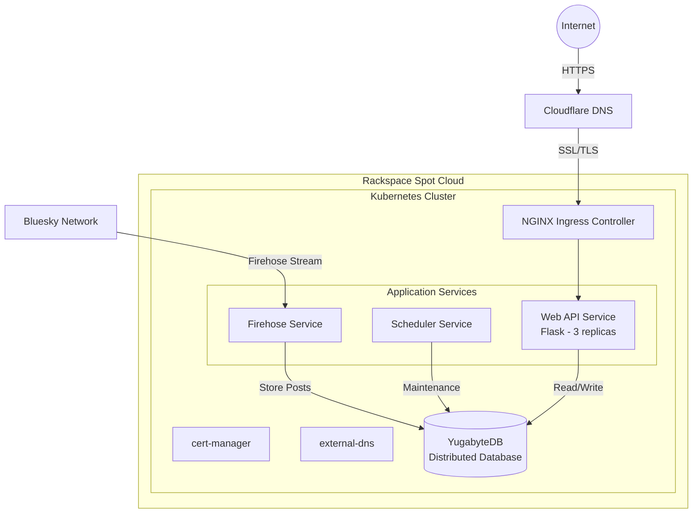

# 🌟 Cosmere ATProto Feed Generator 🌎

<div align="center">

[](#-)
[](#-)
[](#-)
[](#-)
[](#-)

</div>

## 📖 Overview 

A specialized feed service for Brandon Sanderson's Cosmere universe fans, running on Kubernetes and powered by YugabyteDB. This service intelligently filters and combines trending and chronological posts to deliver a curated Cosmere content stream.

## 🏗️ Architecture

The application consists of several microservices deployed on a Kubernetes cluster:

- 🌐 **Web API Service** - Flask application serving the ATProto feed endpoints
- 🔥 **Firehose Service** - Processes the Bluesky firehose stream
- ⏰ **Scheduler Service** - Handles periodic tasks and database maintenance
- 📊 **YugabyteDB** - Distributed PostgreSQL-compatible database

### Infrastructure

- 🚀 Hosted on Rackspace Private Cloud (Spot)
- 🔒 SSL/TLS termination with cert-manager and Let's Encrypt
- 🌍 DNS management with external-dns and Cloudflare
- 🔄 Load balancing with NGINX ingress controller

## 🎯 Filters

### Keywords and Phrases
The feed uses a comprehensive set of filters to capture Cosmere-related content:

<details>
<summary>View Filter Categories</summary>

### 🔤 Tokens
- `allomancy`, `bondsmith`, `cosmere`, `dalinar`, `dawnshard`, `dragonsteel`, `dustbringer`, `edgedancer`, `elantris`, `elsecaller`, `stormblessed`, `thaidakar`, `kholin`, `lightweaver`, `mistborn`, `oathbringer`, `sanderlanche`, `sazed`, `shadesmar`, `skybreaker`, `spren`, `stoneward`, `stormlight`, `surgebinding`, `truthwatcher`, `warbreaker`, `willshaper`, `windrunner`, `roshar`, `scadrial`, `taldain`, `voidbringer`, `shardblade`, `shardplate`, `shardbearer`, `feruchemy`, `hemalurgy`, `lerasium`, `atium`, `mistcloak`, `kandra`, `koloss`, `skaa`, `highstorm`, `parshendi`, `urithiru`, `honorblade`, `surgebinder`, `dawnshard`, `worldhopper`, `perpendicularity`, `adonalsium`, `chasmfiend`, `worldbringer`, `allomancer`, `highspren`, `elantrian`, `inkspren`, `honorspren`, `cultivationspren`, `peakspren`, `ashspren`, `luckspren`, `windspren`, `lifespren`, `towerlight`, `voidlight`, `brandosando`, `numuhukumakiaki'ialunamor`, `dsnx24`, `dsnx2024`, `dragonsteelnexus`, `dragonsteelnexus2024`

### 🔗 Inclusive Multi-Tokens
- `brandon sanderson`, `yumi sanderson`, `vin elend`, `yumi painter`, `shallan adolin`, `kaladin syl`, `kaladin adolin`, `kaladin shallan`, `navani kholin`, `shallan pattern`, `shallan veil`, `shallan radiant`, `vin kelsier`, `kelsier survivor`, `wax wayne marasi`, `steris marasi`, `cryptic spren`, `steris wax`, `szeth nightblood`, `shades threnody`, `threnody hell`

### 📝 Phrases
- `17th shard`, `bands of mourning`, `brandon sanderson`, `cognitive realm`, `rhythm of war`, `shadows of self`, `sixth of the dusk`, `shadows for silence`, `shadows of silence`, `ember dark`, `emperor's soul`, `isles of the ember dark`, `stormlight archive`, `sunlit man`, `alloy of law`, `hero of ages`, `lost metal`, `way of kings`, `well of ascension`, `tress of the emerald sea`, `wind and truth`, `words of radiance`, `yumi and the nightmare painter`, `shattered planes`, `knight radiant`, `knights radiant`, `journey before destination`, `life before death, strength before weakness`, `dragon steel nexus`

### 👥 Handles to Include
- `stormlightmemes.bsky.social`, `brotherwisegames.bsky.social`

</details>



---

## 🛠️ Infrastructure Setup

### Prerequisites
- Kubernetes cluster on Rackspace Spot
- `kubectl` configured with cluster access
- Helm v3 installed
- Docker for building images

### Environment Configuration
Create a `.env` file:
```env
HOSTNAME=cosmere.richardr.dev
HANDLE=your-handle.bsky.social
PASSWORD=your-password
CHRONOLOGICAL_TRENDING_URI=at://...
POSTGRES_USER=cosmerefeed
POSTGRES_PASSWORD=your-password
POSTGRES_DB=feed
POSTGRES_HOST=yugabyte-client.yugabyte.svc.cluster.local
POSTGRES_PORT=5433
GITHUB_PAT=your-github-pat
CLOUDFLARE_API_TOKEN=your-cloudflare-token
```

### Deployment Steps

1. **Initialize Cluster Components**
```bash
cd k8s/helm/
./setup.sh --clear    # Only if you need to reset the cluster
./setup.sh --build    # Build and push all container images
```

2. **Verify Deployment**
```bash
./check_cluster.sh
```

This will display the status of:
- cert-manager pods
- YugabyteDB cluster
- Application pods
- Service endpoints

3. **Individual Component Updates**
```bash
# Update specific components
./setup.sh --build-web
./setup.sh --build-firehose
./setup.sh --build-scheduler
```

## 📡 Service Endpoints

The feed is accessible at:
- 🌐 Public endpoint: `https://cosmere.richardr.dev`
- 🔑 ATProto endpoints:
  - `/.well-known/did.json`
  - `/xrpc/app.bsky.feed.describeFeedGenerator`
  - `/xrpc/app.bsky.feed.getFeedSkeleton`

## 📈 Monitoring

- Health checks are configured for all services
- Liveness and readiness probes ensure service availability
- Database metrics available through YugabyteDB dashboard

## 🚀 Scaling

- Web API horizontally scales with 3 replicas
- YugabyteDB runs with 3 master and 3 tserver nodes
- Firehose and scheduler are single-instance services

## 📜 License

This project is licensed under the MIT License.

---

<div align="center">
💫 Powering Cosmere discussions on Bluesky
</div>